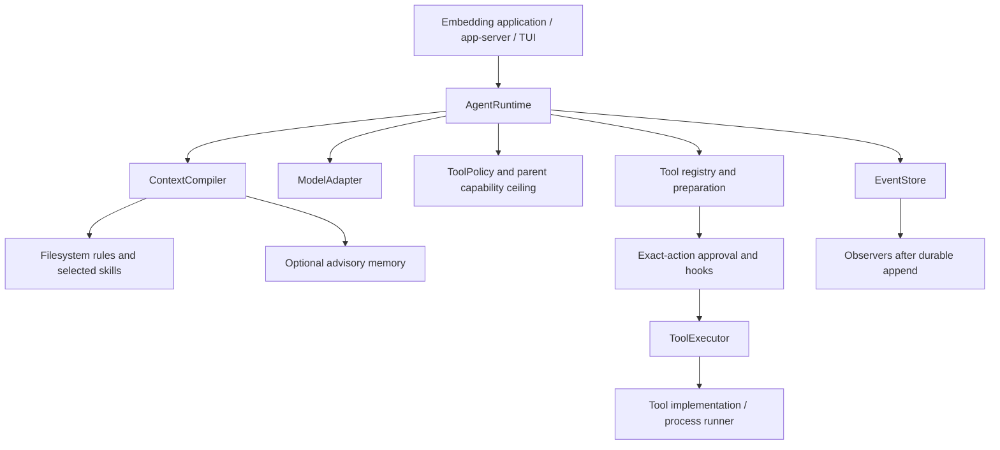

# Nausicaa architecture

This document describes the reliability baseline and subsequent implemented task
acceptance layer. Future capabilities are tracked separately in [ROADMAP.md](ROADMAP.md).
See [README.md](README.md) for setup and API usage, and [AGENTS.md](AGENTS.md) for
contribution constraints.

## Composition and ownership

| Crate | Owns | Does not own |
| --- | --- | --- |
| `harness-core` | Model/tool protocols, thread/turn loop, policy, approvals, hooks, events, receipts, recovery; memory and JSONL event stores | Provider transport, OS sandbox, task acceptance |
| `harness` | Feature-gated re-exports; empty default feature set | Another agent loop |
| `context-fs` | Hierarchical rules, skill index/selection, complete-group transcript window | Semantic summarization or token accounting |
| `memory` | Advisory records, lexical recall, bounded per-turn recall cache | Authorization or a durable task plan |
| `executor-process` | File tools, shell preparation, local and Bubblewrap process runners | Distributed execution or universal process containment |
| `provider-openai` | Chat Completions mapping and replaceable HTTP transport | Streaming, runtime retry policy, task completion |
| `task` | Immutable task criteria, deterministic acceptance, attempt budgets, retained evidence and task journal | Tool authority, worker scheduling, automatic resumption |
| `task-ledger` | Idempotent submission, claims, leases, terminal results, delivery acknowledgement | A running worker service or automatic task retries |
| `app-server` | Line-oriented JSON-RPC control and in-process background-turn tracking | Durable scheduler state |
| `tui` | Terminal interaction, event display, interactive approvals | Core authority or crash-resumable task orchestration |

The TUI embeds `AgentRuntime` directly; it does not route through `AppServer`.
The task ledger is an independent primitive and is not automatically connected to
the runtime, TUI, or a worker scheduler.

## One turn

The implementation is in [runtime.rs](crates/harness-core/src/runtime.rs).

1. Verify the thread and take the runtime's active-thread guard. Reject duplicate
   turn IDs and close interrupted protocol edges under the same guard.
2. Append `TurnStarted` and the user message; reconstruct the transcript from
   durable events. Compute effective tools once for this turn.
3. At each iteration, check cancellation, compile context, invoke `before_model`,
   and append context metadata and `ModelRequestStarted`.
4. Await the model. Validate call IDs before accepting its assistant response,
   then persist the response, stop reason, and usage.
5. Validate the stop contract. `EndTurn` with no calls can complete; `ToolUse`
   with calls can execute. `MaxTokens`/`Other` produce
   `IncompleteModelResponse`. Contradictory stop/call combinations produce
   `InvalidModelResponse`. Accepted calls in these rejected responses get denied
   receipts; no tool executes. Partial assistant content remains inspectable.
6. Check cancellation again before completion or execution. For each tool call,
   check registration/access, prepare its canonical action, invoke `before_tool`,
   and resolve exact-action approval when access is `Ask`.
7. Append execution-start, execute the prepared action, append the receipt, and
   invoke `after_tool`. Add the receipt to the next model context.
8. Continue until normal completion, cancellation, failure, or the configured
   iteration limit (32 by default). Tool calls execute sequentially.

Hooks can reject work; they cannot rewrite an approved canonical action. The
current hook surface has `before_model`, `before_tool`, and `after_tool`, with no
independent task-completion gate. Policy is projected once per turn, so dynamic
mid-turn policy revocation is not currently an implemented guarantee.

## Authority and execution

`Deny` hides a tool and prevents execution; `Ask` exposes it but requires exact
approval; `Allow` permits it through policy. Parent capability intersection can
restrict children, but no child-agent scheduler is included.

`RejectingExecutor` and `DenyAllApprovals` are the defaults. Embedders deliberately
install an executor and, when needed, an approval provider. The included TUI uses
`DirectExecutor` to invoke tool implementations; its shell tool delegates to a
process runner. File tools run in the host process with workspace path checks.
Consequently, selecting Bubblewrap for shell commands does not put every tool
implementation into Bubblewrap.

On Unix, runners create a command process group. They observe child exit with
`waitid(WNOWAIT)` so the leader's PID cannot be reused before group cleanup, kill
remaining group members on timeout or foreground exit, then reap the leader.
Nonblocking, capped stdout/stderr reads prevent output from starving deadline
checks. A 250 ms cleanup window bounds waiting for inherited output descriptors;
an unclosed stream is marked truncated. Exceptional unreaped processes are handed
to a background reaper rather than blocking the caller indefinitely.

Group cleanup is lifecycle management, not containment: descendants can create
new sessions. Bubblewrap additionally provides Linux namespaces and filesystem
mount isolation. Its configured network and bind policy remain separate from
process cleanup. The non-Unix fallback has bounded reader joining but does not
provide the Unix group-cleanup guarantee.

The model and process interfaces are asynchronous-looking at the runtime boundary,
but included provider/process implementations still block internally. Cancellation
is cooperative and cannot currently interrupt an in-flight blocking model request
or shell runner immediately.

## Durable state and recovery

The [event store](crates/harness-core/src/store.rs) owns runtime history. A
successful JSONL append is flushed and synced before observers are called.
Observers are synchronous; they are not an independent durable delivery queue.
If an executed action's receipt cannot be persisted, the runtime returns
`ReceiptPersistenceUnknown` instead of continuing with an apparently known result.

`JsonlEventStore::open` distinguishes these cases:

| On-disk state | Behavior |
| --- | --- |
| Valid newline-terminated records | Replay normally |
| Complete final record without newline | Preserve it and durably append the missing newline |
| Unterminated final record with an EOF parse error | Durably archive raw bytes to `<log>.torn-<event-id>`, then truncate to the valid prefix |
| Other malformed records, including newline-terminated incomplete JSON | Fail without treating the corruption as a repairable tail |

`recovered_tail_path()` exposes the archive created during that open. An append
I/O failure disables subsequent writes on that instance until it is reopened.
This repair protocol is implemented only in the core event store; memory and
task-ledger JSONL readers still reject malformed tails.

[Recovery](crates/harness-core/src/recovery.rs) records missing call receipts:
started executions become `unknown`; calls that never started become failed.
Interrupted turns become failed. It never automatically replays external actions.
`AgentRuntime::recover` rejects active turns in the same runtime;
`recover_thread` is a lower-level API requiring exclusive ownership by its caller.

These are in-process guarantees, not cross-process transactions. Separate store
instances are not coordinated, JSONL histories are loaded into memory, and there
is no checkpoint/snapshot format or distributed locking protocol. Applications
must coordinate ownership before sharing a log.

## Background tasks and leases

[JsonlTaskLedger](crates/task-ledger/src/lib.rs) stores a separate event history.
Submission is idempotent by caller key; a claim increments the existing attempt
counter and sets worker identity and expiry. `LeaseToken` derives from those
existing fields, so the reliability change adds no required serialized field.

`heartbeat`, `succeed`, and `fail` now require `(task_id, token, now_unix_ms, ...)`.
Validation and mutation occur under the same ledger mutex: the task must be
running, the token's worker/attempt must match, and the supplied trusted-host time
must be before expiry. A heartbeat must extend the current expiry. Tokens identify
claims; authentication belongs to the embedding control plane.

An expired lease becomes terminal `Unknown` when recovery runs. Before recovery,
expiry already prevents a late heartbeat or result. There is no automatic
requeue, and no API currently creates a subsequent claim for an unknown task.
Terminal results have an explicit pending/acknowledged delivery state, but no
resident delivery service.

## Context and interfaces

`FsContextCompiler` assembles stable segments, root-to-leaf rules, a skill index,
selected skill bodies, and volatile segments. `AGENTS.override.md` takes precedence
over `AGENTS.md` in a directory. Old transcript groups may be omitted without
splitting an assistant tool-call message from its receipts. No semantic summary
is generated. The configured character cap is an approximate byte-size check,
not accounting for the complete provider request or model tokens.

`MemoryContextCompiler` appends advisory lexical recall and reuses cached recall
within a turn. Its bounded snapshot cache is not a persistent task checkpoint.
No code path grants policy authority to recalled text.

`ModelAdapter` returns a complete response. The included adapter uses non-streaming
Chat Completions through a blocking curl transport. Model errors carry a retryable
flag, but the runtime does not implement automatic retries. There is no token/cost
budget beyond recorded input/output usage and the iteration limit.

The app server stores turn-control/status entries in memory; durable events do not
automatically reconstruct that table. The TUI starts a new thread on startup and
does not yet expose a resume workflow.

## Extension direction

Keep task acceptance, context strategies, provider profiles, artifact storage,
evaluation, and orchestration optional. Future task completion must be distinct
from normal model turn completion. Future resumption must reconcile uncertain
actions rather than retrying them implicitly. The ordered acceptance criteria and
unresolved design choices are in [ROADMAP.md](ROADMAP.md).

## Task acceptance

The optional [task crate](crates/task/src/lib.rs) sits outside the core turn loop.
The host creates an immutable `TaskSpec` with a nonempty objective, required
criteria, and a positive attempt budget. `CompletionGate` compares retained UTF-8
artifact snapshots against exact expected contents. Missing or duplicate snapshots
fail the associated check. This first checker suits small deterministic fixtures;
it does not compile arbitrary programs or claim general coding quality.

`TaskJournal` owns one task per exclusively owned JSONL file. Version 1 records
creation, attempt start (with a host-supplied core turn ID), verification inputs
(artifact snapshots and receipts), and explicit blocking. Replay validates the
version, sequence, specification and transitions, and derives evidence using the
version-1 checker. Changes to that checker require a new journal version, never
reinterpretation of existing evidence. Existing core, memory and ledger formats
and public signatures are unchanged; the facade adds an opt-in `task` feature.

An attempt is synced before generation. Verification still runs on the final
allowed attempt, so generation cannot consume the verification opportunity.
Failing checks produce actionable remaining work or terminal budget exhaustion.
Passing checks produce success only if no supplied receipt is unknown; unknown
outcomes block the task without retry. Denied receipts are preserved and do not
independently prevent success if all artifact criteria pass. Terminal states have
no reopen or retry API. Interrupted running attempts remain running after replay;
the host must reconcile them, supply known evidence, or explicitly block them.

The trusted host must supply complete receipts from the associated turn and
capture artifacts independently of model claims. Logical artifact IDs are not
paths the task crate opens; complete contents are retained in the task journal,
so evidence does not depend on later workspace edits. Repair feedback is ordinary
context for a subsequent core turn and cannot modify policy, grants or approvals.
This API is a trusted embedding boundary, not authentication for untrusted clients.

Writes sync before state publication; any I/O failure disables further writes on
that instance. Malformed or unterminated journals fail closed without tail repair.
No cross-instance locking, transactional link to the core log, automatic scheduler,
size limit, wall-clock limit or token budget is supplied here. Hosts own retention,
exclusive file ownership, execution limits and sensitive artifact handling.
