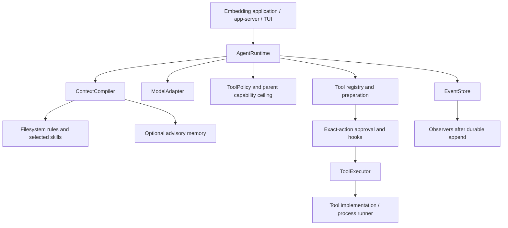

# Nausicaa architecture

This document describes the reliability baseline and subsequent implemented task
acceptance layer. Future capabilities are tracked separately in [ROADMAP.md](ROADMAP.md).
See [README.md](README.md) for setup and API usage, and [AGENTS.md](AGENTS.md) for
contribution constraints.

## Composition and ownership

| Crate | Owns | Does not own |
| --- | --- | --- |
| `harness-core` | Model/tool protocols, thread/turn loop, policy, approvals, hooks, events, receipts, recovery; memory and JSONL event stores | Provider transport, OS sandbox, task acceptance |
| `harness` | Feature-gated re-exports; empty default feature set | Another agent loop |
| `context-fs` | Hierarchical rules, skill index/selection, complete-group transcript window, optional output archive and paginated retrieval | Semantic summarization or model tokenization |
| `memory` | Advisory records, lexical recall, bounded per-turn recall cache | Authorization or a durable task plan |
| `executor-process` | File tools, shell preparation, local and Bubblewrap process runners | Distributed execution or universal process containment |
| `provider-openai` | Chat Completions mapping and replaceable HTTP transport | Streaming, runtime retry policy, task completion |
| `eval` | Paired isolated task fixtures, evidence and metrics; opt-in live runs | General semantic code verification or production scheduling |
| `task` | Immutable task criteria, deterministic acceptance, attempt budgets, retained evidence and task journal | Tool authority, worker scheduling, automatic resumption |
| `task-ledger` | Idempotent submission, claims, leases, terminal results, delivery acknowledgement | A running worker service or automatic task retries |
| `app-server` | Line-oriented JSON-RPC control and in-process background-turn tracking | Durable scheduler state |
| `tui` | Terminal interaction, event display, interactive approvals | Core authority or crash-resumable task orchestration |

The TUI embeds `AgentRuntime` directly; it does not route through `AppServer`.
The task ledger is an independent primitive and is not automatically connected to
the runtime, TUI, or a worker scheduler.

## One turn

The implementation is in [runtime.rs](crates/harness-core/src/runtime.rs).

1. Verify the thread and take the runtime's active-thread guard. Reject duplicate
   turn IDs and close interrupted protocol edges under the same guard.
2. Append `TurnStarted` and the user message; reconstruct the transcript from
   durable events. Compute effective tools once for this turn.
3. At each iteration, check cancellation, compile context, invoke `before_model`,
   and append context metadata and `ModelRequestStarted`.
4. Await the model. Validate call IDs before accepting its assistant response,
   then persist the response, stop reason, and usage.
5. Validate the stop contract. `EndTurn` with no calls can complete; `ToolUse`
   with calls can execute. `MaxTokens`/`Other` produce
   `IncompleteModelResponse`. Contradictory stop/call combinations produce
   `InvalidModelResponse`. Accepted calls in these rejected responses get denied
   receipts; no tool executes. Partial assistant content remains inspectable.
6. Check cancellation again before completion or execution. For each tool call,
   check registration/access, prepare its canonical action, invoke `before_tool`,
   and resolve exact-action approval when access is `Ask`.
7. Append execution-start, execute the prepared action, append the receipt, and
   invoke `after_tool`. Add the receipt to the next model context.
8. Continue until normal completion, cancellation, failure, or the configured
   iteration limit (32 by default). Tool calls execute sequentially.

Hooks can reject work; they cannot rewrite an approved canonical action. The
current hook surface has `before_model`, `before_tool`, and `after_tool`, with no
independent task-completion gate. Policy is projected once per turn, so dynamic
mid-turn policy revocation is not currently an implemented guarantee.

## Authority and execution

`Deny` hides a tool and prevents execution; `Ask` exposes it but requires exact
approval; `Allow` permits it through policy. Parent capability intersection can
restrict children, but no child-agent scheduler is included.

`RejectingExecutor` and `DenyAllApprovals` are the defaults. Embedders deliberately
install an executor and, when needed, an approval provider. The included TUI uses
`DirectExecutor` to invoke tool implementations; its shell tool delegates to a
process runner. File tools run in the host process with workspace path checks.
Consequently, selecting Bubblewrap for shell commands does not put every tool
implementation into Bubblewrap.

On Unix, runners create a command process group. They observe child exit with
`waitid(WNOWAIT)` so the leader's PID cannot be reused before group cleanup, kill
remaining group members on timeout or foreground exit, then reap the leader.
Nonblocking, capped stdout/stderr reads prevent output from starving deadline
checks. A 250 ms cleanup window bounds waiting for inherited output descriptors;
an unclosed stream is marked truncated. Exceptional unreaped processes are handed
to a background reaper rather than blocking the caller indefinitely.

Group cleanup is lifecycle management, not containment: descendants can create
new sessions. Bubblewrap additionally provides Linux namespaces and filesystem
mount isolation. Its configured network and bind policy remain separate from
process cleanup. The non-Unix fallback has bounded reader joining but does not
provide the Unix group-cleanup guarantee.

The provider future waits for a worker-thread wakeup. Its supervised curl child
checks cancellation and deadlines while draining bounded output. On Unix cancellation
kills its process group and arranges reaping; other platforms kill the direct child.
Built-in shell runners check cancellation during their synchronous capture loop;
legacy adapters/transports and custom runners can still block cancellation.

## Durable state and recovery

The [event store](crates/harness-core/src/store.rs) owns runtime history. A
successful JSONL append is flushed and synced before observers are called.
Observers are synchronous; they are not an independent durable delivery queue.
If an executed action's receipt cannot be persisted, the runtime returns
`ReceiptPersistenceUnknown` instead of continuing with an apparently known result.

`JsonlEventStore::open` distinguishes these cases:

| On-disk state | Behavior |
| --- | --- |
| Valid newline-terminated records | Replay normally |
| Complete final record without newline | Preserve it and durably append the missing newline |
| Unterminated final record with an EOF parse error | Durably archive raw bytes to `<log>.torn-<event-id>`, then truncate to the valid prefix |
| Other malformed records, including newline-terminated incomplete JSON | Fail without treating the corruption as a repairable tail |

`recovered_tail_path()` exposes the archive created during that open. An append
I/O failure disables subsequent writes on that instance until it is reopened.
This repair protocol is implemented only in the core event store; memory and
task-ledger JSONL readers still reject malformed tails.

[Recovery](crates/harness-core/src/recovery.rs) records missing call receipts:
started executions become `unknown`; calls that never started become failed.
Interrupted turns become failed. It never automatically replays external actions.
`AgentRuntime::recover` rejects active turns in the same runtime;
`recover_thread` is a lower-level API requiring exclusive ownership by its caller.

These are in-process guarantees, not cross-process transactions. Separate store
instances are not coordinated, JSONL histories are loaded into memory, and there
is no checkpoint/snapshot format or distributed locking protocol. Applications
must coordinate ownership before sharing a log.

## Background tasks and leases

[JsonlTaskLedger](crates/task-ledger/src/lib.rs) stores a separate event history.
Submission is idempotent by caller key; a claim increments the existing attempt
counter and sets worker identity and expiry. `LeaseToken` derives from those
existing fields, so the reliability change adds no required serialized field.

`heartbeat`, `succeed`, and `fail` now require `(task_id, token, now_unix_ms, ...)`.
Validation and mutation occur under the same ledger mutex: the task must be
running, the token's worker/attempt must match, and the supplied trusted-host time
must be before expiry. A heartbeat must extend the current expiry. Tokens identify
claims; authentication belongs to the embedding control plane.

An expired lease becomes terminal `Unknown` when recovery runs. Before recovery,
expiry already prevents a late heartbeat or result. There is no automatic
requeue, and no API currently creates a subsequent claim for an unknown task.
Terminal results have an explicit pending/acknowledged delivery state, but no
resident delivery service.

## Context and interfaces

`FsContextCompiler` assembles stable segments, root-to-leaf rules, a skill index,
selected skill bodies, and volatile segments. `AGENTS.override.md` takes precedence
over `AGENTS.md` in a directory. Old transcript groups may be omitted without
splitting an assistant tool-call message from its receipts. No semantic summary
is generated. The configured character cap is an approximate byte-size check,
not accounting for the complete provider request or model tokens.

`MemoryContextCompiler` appends advisory lexical recall and reuses cached recall
within a turn. Its bounded snapshot cache is not a persistent task checkpoint.
No code path grants policy authority to recalled text.

`ModelAdapter` returns a complete response. The included adapter supports optional
SSE Chat Completions through supervised curl. Model errors carry a retryable
flag, but the runtime does not implement automatic retries. An optional provider request budget now accounts for the final body using a
host-supplied model-specific counter; no cumulative task token/cost budget exists.

The app server stores turn-control/status entries in memory; durable events do not
automatically reconstruct that table. The TUI starts a new thread on startup and
does not yet expose a resume workflow.

## Extension direction

Keep task acceptance, context strategies, provider profiles, artifact storage,
evaluation, and orchestration optional. Future task completion must be distinct
from normal model turn completion. Future resumption must reconcile uncertain
actions rather than retrying them implicitly. The ordered acceptance criteria and
unresolved design choices are in [ROADMAP.md](ROADMAP.md).

## Task acceptance

The optional [task crate](crates/task/src/lib.rs) sits outside the core turn loop.
The host creates an immutable `TaskSpec` with a nonempty objective, required
criteria, and a positive attempt budget. `CompletionGate` compares retained UTF-8
artifact snapshots against exact expected contents. Missing or duplicate snapshots
fail the associated check. This first checker suits small deterministic fixtures;
it does not compile arbitrary programs or claim general coding quality.

`TaskJournal` owns one task per exclusively owned JSONL file. Version 1 records
creation, attempt start (with a host-supplied core turn ID), verification inputs
(artifact snapshots and receipts), and explicit blocking. Replay validates the
version, sequence, specification and transitions, and derives evidence using the
version-1 checker. Changes to that checker require a new journal version, never
reinterpretation of existing evidence. Existing core, memory and ledger formats
and public signatures are unchanged; the facade adds an opt-in `task` feature.

An attempt is synced before generation. Verification still runs on the final
allowed attempt, so generation cannot consume the verification opportunity.
Failing checks produce actionable remaining work or terminal budget exhaustion.
Passing checks produce success only if no supplied receipt is unknown; unknown
outcomes block the task without retry. Denied receipts are preserved and do not
independently prevent success if all artifact criteria pass. Terminal states have
no reopen or retry API. Interrupted running attempts remain running after replay;
the host must reconcile them, supply known evidence, or explicitly block them.

The trusted host must supply complete receipts from the associated turn and
capture artifacts independently of model claims. Logical artifact IDs are not
paths the task crate opens; complete contents are retained in the task journal,
so evidence does not depend on later workspace edits. Repair feedback is ordinary
context for a subsequent core turn and cannot modify policy, grants or approvals.
This API is a trusted embedding boundary, not authentication for untrusted clients.

Writes sync before state publication; any I/O failure disables further writes on
that instance. Malformed or unterminated journals fail closed without tail repair.
No cross-instance locking, transactional link to the core log, automatic scheduler,
size limit, wall-clock limit or token budget is supplied here. Hosts own retention,
exclusive file ownership, execution limits and sensitive artifact handling.

## Evaluation boundary

The standalone [evaluation crate](crates/eval/README.md) runs identical versioned
fixtures against core-only and task-layer embeddings. It registers the existing
file writer and keeps policy and execution paths intact. Core-only stops at one
normal turn; task mode feeds durable repair feedback into another bounded turn.
Independent exact-content checks inspect retained snapshots in both modes.

Each run uses a new directory and retains the fixture, source, core events,
per-attempt evidence, task events where applicable, and a JSON metrics report.
The held-out regression files are separate from development fixtures. The
interruption fixture drops a pending executor future, recovers the core, and
records the unknown receipt without retry; denied fixtures fabricate calls to a
policy-hidden writer to exercise rejection. This is deterministic fault injection,
not a measurement of real model behavior or filesystem containment.

The optional `live` CLI feature requires explicit pinned model/deployment metadata
and records provider settings separately from credentials. Its optional
`timeout_seconds` accepts 1–300 seconds; omitted values retain the original
30-second default, and reports record the effective value. This additive live
configuration field changes no journal or report schema version. Pin validity belongs
to the host. Live runs skip the scripted interruption fixture and report the skip;
default tests never use network or credentials. Schema-version-1 reports are new
artifacts and change no existing durable formats. Package version plus retained
fixture/configuration bytes identify the baseline; hosts should also retain their
checkout revision when comparing locally modified builds.

## Final request accounting and pinned task context

`TaskContextCompiler` wraps an existing compiler and prepends a serialized immutable
`TaskSpec` after inner compilation. It is scoped to one task and must be outermost
when preserving the contract. It does not change transcript calls or receipts,
acceptance criteria, policy, or approvals. The inner character limit does not
include this later segment, so it is not a final request limit.

The optional provider `RequestBudget` is enforced after complete Chat Completions
mapping, extension fields, and output-cap insertion, before HTTP transport. Its
trusted `RequestTokenCounter` receives that exact body and must account for the
selected model's framing, tools, messages and supported extensions. Unknown model
accounting must return an error; no universal byte/token ratio is assumed. A test
counter uses serialized bytes only as a deterministic oracle, not a real tokenizer.
Input must fit `context_window_tokens - reserved_output_tokens`; subtraction is
validated on installation and never uses overflow-prone input-plus-output addition.

Absent output caps become `max_completion_tokens` equal to the reservation. A
single existing positive modern or legacy cap can be smaller; invalid, conflicting
or larger caps fail closed. All counting/configuration/over-budget errors are
non-retryable and never cross transport. No trimming occurs at this boundary, so
call/receipt groups and task constraints cannot be silently truncated to fit.

This adds opt-in builders and types without changing core events, serialized task
records, or existing constructors/configuration fields. Existing adapters remain
unbudgeted. One intentional mapping correction applies to all adapters:
`extra_body.tools`, `functions`, and `function_call` are removed before sending;
only policy-projected registered schemas can be exposed. `tool_choice` is also
removed when the projection is empty. Hosts that injected schemas through extra
fields must register/grant them through the core instead. Model tokenization is
host-supplied; automatic token-driven compaction and aggregate spending limits remain separate
work. Output externalization is described below.

## Archived tool output

The opt-in `ExternalOutputCompiler` in `context-fs` archives oversized serialized
receipt output before passing a cloned transcript to its inner compiler. The
resulting version-1 reference contains the original call ID, byte size, JSON
format and retrieval tool name. Call/receipt grouping, status, canonical action,
errors, and the core event log remain unchanged. Wrap it with `TaskContextCompiler`
to pin the task contract after compaction, then apply final provider accounting.
An integration fixture drops old chat and externalizes a 55 KB output while
retaining the contract and call/receipt pair within the final test-counter budget.

`OutputArchive` uses a trusted host directory outside tool-writable workspaces.
Thread and call IDs are injectively hex-encoded into separate bounded path
components (1–96 UTF-8 bytes per ID). Each snapshot contains the original JSON
value. A new file is fully written and synced under a private temporary name,
then hard-linked to its final name without overwrite; Unix directory sync occurs
before publishing the reference. Normal failures clean temporary files; crashes
may leave unreferenced `.pending-*` files for host cleanup. Repeated compilation
checks and reuses the same bytes. Conflicts, oversize output, unsupported hard links,
symlinked entries, and I/O failures reject compilation without silent data loss.
There is no cross-instance lock or protection against a hostile owner racing path
checks. This is storage lifecycle management, not an OS sandbox or tamper-proof CAS.

`ReadOutputTool` is registered and authorized explicitly, using the normal policy,
preparation, approval, executor, and receipt path. Preparation binds the current
thread and exact call ID/byte offset/page size; execution cannot select another
thread from model arguments. Pages are bounded to 4096 UTF-8 bytes, report a next
byte offset, and never split a character. Invalid offsets fail. Retrieval outputs
are not recursively externalized. Durable receipt output is still fully available
for independent task evidence; task journal snapshots are not replaced by these
context references. Old compacted references are not automatically indexed, and
retention/garbage collection remains a host responsibility. This new archive and
reference format does not migrate or rewrite any existing journal.

## TUI request configuration

The executable validates request options before opening the terminal. CLI values
precede environment variables. Timeout defaults to 120 seconds (1–600), completion
output to 4096 tokens (1–131072), per-turn requests to 32 (1–128), and retained
transcript groups to 200 (1–2000). Temperature is optional (finite, 0–2). Invalid,
duplicate and unknown options are rejected. These settings configure existing
provider/runtime/context boundaries; they do not grant tools or change journals.
The new default output cap is an intentional TUI behavior change; the provider
library constructor remains non-streaming by default; the TUI enables SSE unless
`--no-stream` is selected.

## Model progress and request cancellation

`ModelControl`, `ModelProgressObserver` and the default `complete_controlled`
method are additive APIs. Legacy adapters retain their existing behavior. Progress
is ephemeral and separate from durable `RuntimeEvent`: it cannot authorize tools,
prove acceptance, or enter replay. Existing journals need no migration.

Only text deltas are observable before completion. Tool fragments are assembled
privately (one choice, at most 128 calls), then parsed after successful HTTP/child
completion and SSE finish reason plus `[DONE]`. Missing terminators and malformed
streams fail. Core validation and receipt ordering remain unchanged. Curl response
storage is capped at 8 MiB and SSE lines/events at 1 MiB. Dropping a model future
cancels its own request without cancelling the parent's shared token. Runtime model
errors observed with cancellation persist `TurnCancelled`, not `TurnFailed`.

DNS/TCP/TLS are curl phase durations; first-byte and first-text are elapsed from
request start, not additive phases. Total and first text use a monotonic host clock.
Diagnostics do not identify provider queue or inference time separately. Observer
callbacks run on the request worker and should return promptly. A custom transport
must implement the additive controlled method for interruptible streaming; its
legacy fallback only checks cancellation before and after the blocking call.

## TUI progress ownership

`run_with_model_progress` is additive; existing `run` callers keep their API.
The executable shares a `ModelProgressBuffer` with the runtime's model observer.
It coalesces text into a 64 KiB UTF-8 tail, stores at most 16 pending summaries,
and writes only finished request metrics to a separate version-1 JSONL diagnostic
file. Text deltas never enter that file or the durable runtime journal. Metrics
writes are best-effort and not fsynced; failures appear in the UI. No rotation is
provided. Rendering strips text control characters and labels drafts unvalidated.

Preview identity is thread/turn/iteration. Durable assistant or terminal events
settle it; late deltas cannot revive a settled or cancelled draft. Final assistant
content is rendered from the durable event once, without a second copy from the
worker result. The status timer uses the UI's monotonic clock and refreshes while
waiting; network phase timings come from the provider. Ctrl-C during a turn cancels
and denies approvals; idle Ctrl-C exits. Exit waits at most two seconds while
rejecting approvals, and state drop also signals cancellation on terminal errors.
The TUI worker executor parks until woken instead of polling in a busy loop.

## Cancellation across the shell execution boundary

`ShellTool` passes the existing execution-context token through the additive
`ProcessRunner::run_controlled` method. Both built-in backends check it before
spawn and between bounded pipe-drain batches. Unix cleanup kills the group before
reaping the leader (preventing PID reuse races) and keeps the existing 250 ms
cleanup window; exceptional unreaped leaders go to a background reaper. A
non-Unix cancellation kills only the direct child and schedules reaping. This is
process cleanup, not an additional containment boundary.

The API is still synchronous. TUI cancellation is signalled from its UI thread;
embedding hosts need another thread to signal a token while `run_controlled`
blocks. Dropping a future is not an interrupt mechanism for a currently executing
synchronous poll. Legacy runner implementations compile unchanged and only check
cancellation around their blocking call unless they override the new method.

Interrupted shell effects are not assumed absent. `ProcessError::Cancelled`
becomes the new `ToolError::OutcomeUnknown`; the runtime records an existing
`Unknown` receipt, then closes remaining accepted calls and records `TurnCancelled`.
No partial output is returned as success, and there is no automatic retry or
rollback. This reuses existing durable event/receipt shapes without changing old
records or replay semantics. Downstream exhaustive matches on `ProcessError` and
`ToolError` must handle the added variants; `ProcessRequest` and `ProcessOutput`
are unchanged.

Regression tests cancel both quiet and continuously writing shells before their
30-second timeout. A runtime fixture verifies child cleanup, preservation of an
already-created artifact, absence of subsequent effects, unknown/denied receipts
for accepted calls, and receipt-before-cancellation ordering. An actual TUI test
with a local model fixture and explicit shell approval observed termination 51 ms
after Ctrl-C and an `Unknown` receipt on both local and Bubblewrap backends. This measurement is not a latency guarantee
or proof of sandbox containment.
